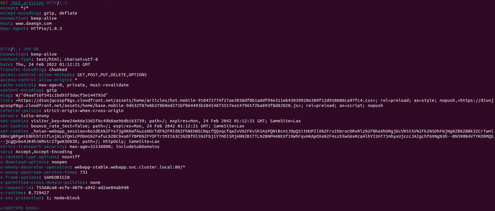
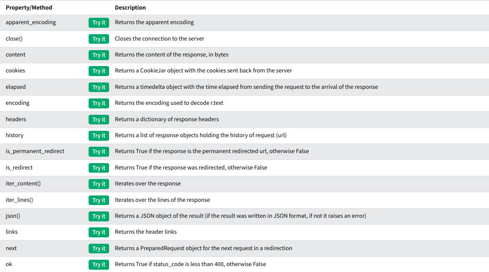
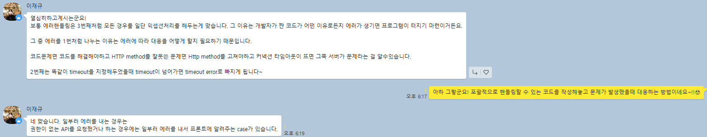

# 1주차 과제

### 당근마켓 중고상품정보 크롤링 

- 타겟 URL: https://www.daangn.com/hot_articles
- 과제 요구사항

    - HTTP 통신을 위해 [requests](https://docs.python-requests.org/en/latest/) 라이브러리를 설치한다.
        
        ```
        pip install requests
        ```

    - 원하는 정보를 `Parsing` 하기 위해 [Beautifulsoup](https://www.crummy.com/software/BeautifulSoup/bs4/doc/) 라이브러리를 설치한다.  

        ```
        pip install beautifulsoup4
        ```
    - 당근마켓 서버에 `GET` 요청을 보내 중고상품정보를 전달받는다.
    
        먼저 간단하게 http 테스트를 위해 `httpie`를 설치하여 Target URL에 `GET` 요청을 보낸 후 응답메세지를 확인해보자
        
            
            # sudo apt install httpie # ubuntu일 경우
            http -v GET "https://www.daangn.com/hot_articles"
            
        HTTP 메세지는 서버와 클라이언트 간에 데이터가 교환되는 방식이다. 클라이언트는 서버에 `GET` 요청을 전달하여 서버로부터 액션이 일어나게 하고 응답메시지를 전달받을 수 있다.

        
        <div align='center' style="margin: 30px 0px">
            
        </div>

        HTTP 메시지 구조에 대한 자세한 설명은 https://developer.mozilla.org/ko/docs/Web/HTTP/Messages 를 참고하자

    - 중고상품 페이지를 크롤링할때  로그인은 필요없으므로 `GET` 요청만 보내면 정보를 받아올 수 있다.

        ```
        webpage = requests.get("https://www.daangn.com/hot_articles")
        ```

        - webpage는 `Response` 객체이고 이 객체로부터 원하는 정보를 가져올 수 있다.

        - 이 객체는 `HTTP 요청`에 대한 서버의 응답이며 다음과 같이 다양한 기능을 사용할 수 있다.

        <div align='center' style="margin: 30px 0px">
            
        </div>
        
        References: [Python requests.Response Object](https://www.w3schools.com/python/ref_requests_response.asp), [Response content](https://docs.python-requests.org/en/latest/user/quickstart/)

    - 서버로부터 응답받은 `webpage` 객체와 `html.parser` 를 사용해 Beautifulsoup 객체를 생성한다.

        ```python
        soup = BeautifulSoup(webpage.content, "html.parser")
        ```

        - webpage.content에는 직렬화된 byte 코드가 담겨있고 `html.parser`를 이용해 구문을 분석하여 문서화된 Beautifulsoup 객체를 생성할 수있다.
        
        <br>

        ```python
        print(webpage.content)
        
        b'<!DOCTYPE html>\n<html lang="ko">\n<head>\n  <meta charset="utf-8">\n  <meta http-equiv="X-UA-Compatible" content="IE=edge">\n  <meta name="viewport" content="width=device-width,initial-scale=1,maximum-scale=1,user-scalable=no">
        ```

    - `BeautifulSoup`에는 [SoupSieve](https://facelessuser.github.io/soupsieve/) 패키지를 사용하여 구문 분석된 문서에 대해 `CSS Selector`를 실행하고 일치하는 모든 요소를 반환하는 `select` 메서드를 사용할 수 있다.

        ```python
        # 사용예시
        soup.select("title")
        # [<title>The Dormouse's story</title>]

        soup.select("p:nth-of-type(3)")
        # [<p class="story">...</p>]
        ```

        - Return 타입은 요소가 하나일 경우 `bs4.element.Tag` 객체를 반환하며 2개 이상일 경우 내부 원소가 `Tag` 로 구성된 `list` 를 반환한다.  
        - `Beautifulsoup`는 HTML 문서를 파이썬 객체의 복잡한 트리로 변환하며 4가지 객체(`Tag` , `NavigableString`, `BeautifulSoup`, `Comment`를 사용할 수 있다.
        
        <br>

        ```python
        # tag 객체 사용예시
        
        soup = BeautifulSoup('<b class="boldest">Extremely bold</b>', 'html.parser')
        tag = soup.b
        type(tag)
        
        # <class 'bs4.element.Tag'>

        # Name
        tag.name
        # 'b'

        # Attributes
        tag['class]
        # 'boldest'

        tag.attrs
        # {'class': 'boldest'}

        ```

    - `cards-wrap` 태그 아래의 모든 `article` 을 가져오고 반환된 `getItem` 은 `iterable`한 list 이므로 반복문을 통해 `Tag` 객체의 `.select()`를 사용해 원하는 정보를 `Parsing` 할 수 있다. 

        ```python
        # article 정보를 담을 리스트
        article_info_list = []

        for i, info in enumerate(articles):

            # article 각각의 정보를 담을 딕셔너리
            article_info_dict = {}
            article_info_dict["id"] = i + 1 # 상품ID
            article_info_dict["desc"] = info.select("a > div.card-desc > h2")[0].text.strip() # 상품설명
            article_info_dict["price"] = info.select("a > div.card-desc > div.card-price")[0].text.strip() # 상품가격
            article_info_dict["region_name"] = info.select("a > div.card-desc > div.card-region-name")[0].text.strip() # 지역명
            article_info_dict["interest"] = info.select("a > div.card-desc > div.card-counts")[0].text.split()[1] #관심
            article_info_dict["chatting"] = info.select("a > div.card-desc > div.card-counts")[0].text.split()[-1] # 채팅
            article_info_dict["img_url"] = info.select("a > div.card-photo > img")[0]["src"] # 이미지경로
            article_info_list.append(article_info_dict)

        print(article_info_list)
        ```
---
### 결과

<div align='center' style="margin-top:20px">
    
</div>

---
# 추가적으로 학습할 내용

###  HTTP Response 응답 메세지

- [HTTP 메시지](https://developer.mozilla.org/ko/docs/Web/HTTP/Messages)
- 당근마켓에서 받아온 메시지 정보도 자세히 분석해봐야겠다.

### request exception handling

[requests.exceptions](https://docs.python-requests.org/en/master/_modules/requests/exceptions/)의 소스코드를 보면 서버에 요청을 보낼 때 발생할 수 있는 다양한 에러가 구현돼있다. 이 많은 Exception들을 모두 코드에 적으면 코드가 길어지고 가독성이 떨어지는 것 같아 멘토님께 질문을 드렸는데 궁금한 내용을 명쾌하게 답변해주셨다! 처음부터 모든 상황을 다 고려하기보다는 포괄적으로 핸들링할 수 있는 코드를 생각해보고 문제가 발생했을 때 빠르게 대처하는 방법을 사용한다고 한다.

---
```python

# 점점 예외처리해야 하는 클래스가 많아져서 코드 가독성이 떨어지는 것 같아요 :<
try:
    res = requests.get(url)
except HTTPError:
    raise HTTPError("HTTPError occured")
except ConnectionError:
    raise ConnectionError("HTTPError occured")
except TimeoutError:
    raise TimeoutError("HTTPError occured")

```

---
```python
# timeout 제한 추가
# 이 경우에 예외를 어떻게 전달해야할지 결정하기가 어려웠습니다..
try:
		req = requests.get(url, timeout=5.0)
except (HTTPError, ConnectionError, TimeoutError) as e:
		1. raise ??
		2. return None
		3. print(f"Error occured: {e}") 
```

---
```python
# 구글링을 통해서 찾은 가장 간결한 코드
# requests.exceptions의 모든 클래스는 RequestException를 상속받습니다.

try:
    # 당근마켓 서버에 GET 요청을 보내고 데이터를 응답받음, timeout은 5초 제한
    res = requests.get(url, timeout=5.0)
except RequestException as e: 
    # There was an ambiguous exception that occurred while handling your request
    raise SystemExit(e)

```

<div align='center' style="margin: 30px 0">
    
</div>

---
### html.parser 외의 구문분석기
- [html.parser](https://docs.python.org/ko/3/library/html.parser.html)
- [Parsing XML and HTML with lxml](https://lxml.de/parsing.html)
- [html5lib Parser](https://lxml.de/html5parser.html)

---
### 파이썬 가상환경 장단점 비교

- [파이썬 가상환경은 왜 이렇게 다양하고, 개발자들은 왜 이렇게 다양한 가상환경을 만들었을까?](https://equus3144.medium.com/%ED%8C%8C%EC%9D%B4%EC%8D%AC-%EA%B0%80%EC%83%81%ED%99%98%EA%B2%BD%EC%9D%80-%EC%99%9C-%EC%9D%B4%EB%A0%87%EA%B2%8C-%EB%8B%A4%EC%96%91%ED%95%98%EA%B3%A0-%EA%B0%9C%EB%B0%9C%EC%9E%90%EB%93%A4%EC%9D%80-%EC%99%9C-%EC%9D%B4%EB%A0%87%EA%B2%8C-%EB%8B%A4%EC%96%91%ED%95%9C-%EA%B0%80%EC%83%81%ED%99%98%EA%B2%BD%EC%9D%84-%EB%A7%8C%EB%93%A4%EC%97%88%EC%9D%84%EA%B9%8C-8173992f28e2)

- [poetry 설치 및 사용기](https://velog.io/@matisse/Poetry-%EC%84%A4%EC%B9%98-%EB%B0%8F-%EC%82%AC%EC%9A%A9%EA%B8%B0)

---
### 서버로 받아온 데이터를 저장하기 위해 Flask 서버를 만들고 데이터베이스와 연결하기

- Flask를 사용하다보면 클라이언트로 받아온 정보, 예를들어 `request.json`을 사용하여 비즈니스 로직을 처리했었는데 이번에는 `requests`를 사용하여 서버에서 서버로 요청을 보내는 구조를 생각해보았다. 사실 브라우저인 (척)을 하는 서버를 사용했을 뿐이다...  

- [데코레이터](./util/calc.py)를 사용해 서버로부터 응답을 받아 원하는 정보를 파싱한 데이터를 반환하는 [cralwer](./crawler.py) 함수의 실행 시간을 기록하였다
- 간단하게 서버와 데이터베이스를 연결하고 수집한 데이터를 핸들링해보는 연습을 해보려한다.

---
### Docker

- Flask 서버를 감싸는 Docker 컨테이너를 만들고 이미지를 생성하여 배포하는 작업

- DB를 추가하게 되면 컨테이너를 어떻게 구성해야하는지 잘 모르는데 얼핏 듣기로는 Docker Compose를 사용할 수도 있다고 들었다. 

---
### 많은 이미지 데이터를 수집할 수 있다면 머신러닝 모델을 통해 간단한 서비스를 만들어보고 싶다.

-  기업마다 머신러닝 모델을 서빙하는 파이프라인을 어떻게 구축하는지 테크블로그를 보면서 앞으로의 공부 방향을 설정하고 있는데 [당근마켓의 테크블로그](https://medium.com/daangn/machine-learning/home)에는 이미지, 텍스트, 추천서비스등 다양한 머신러닝 서비스를 사용자들에게 제공하고 있다.

- 앞으로 수집하게 될 다양한 포맷을 핸들링하는 방법을 배우고 머신러닝 모델을 학습하고 배포하는 연습을 해보려한다.