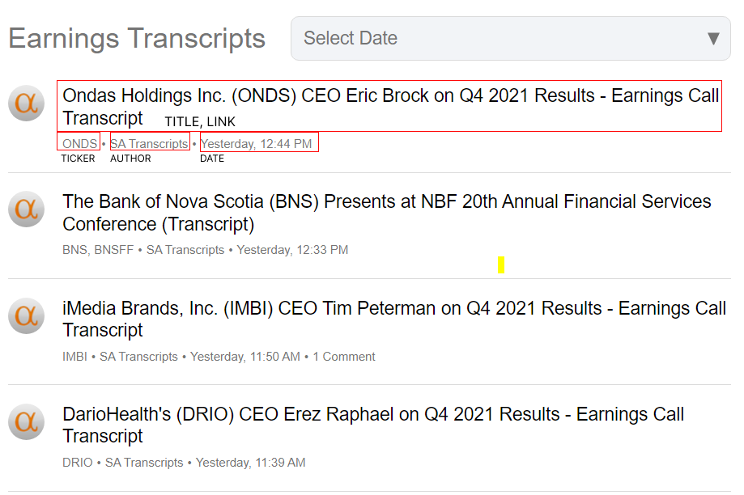
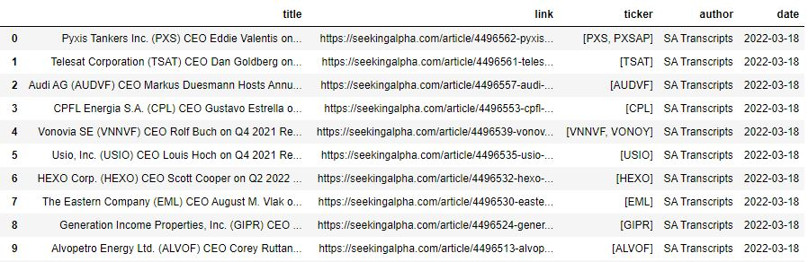
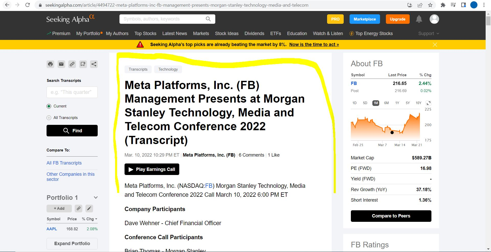
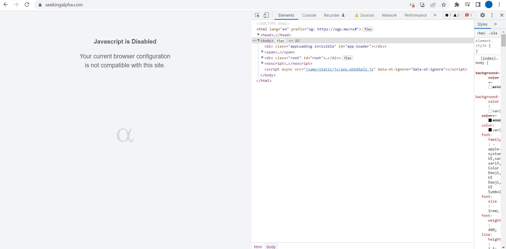
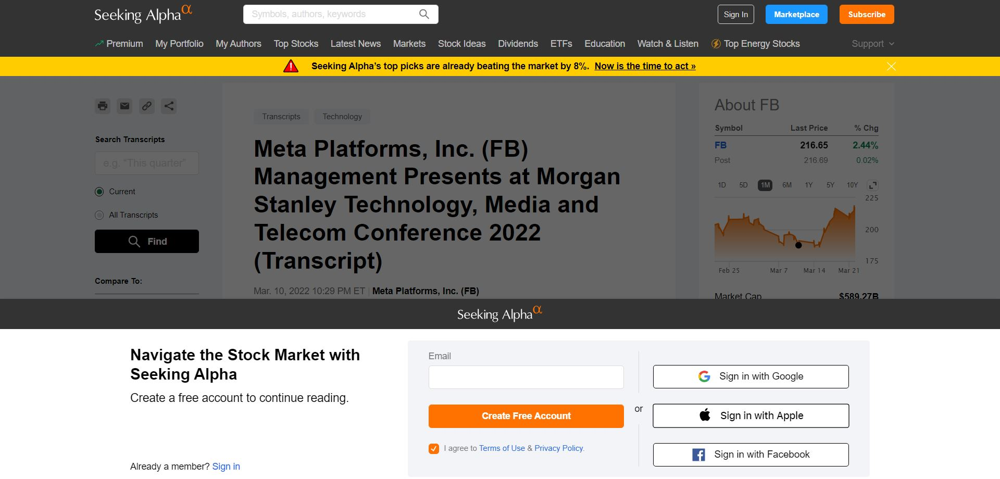
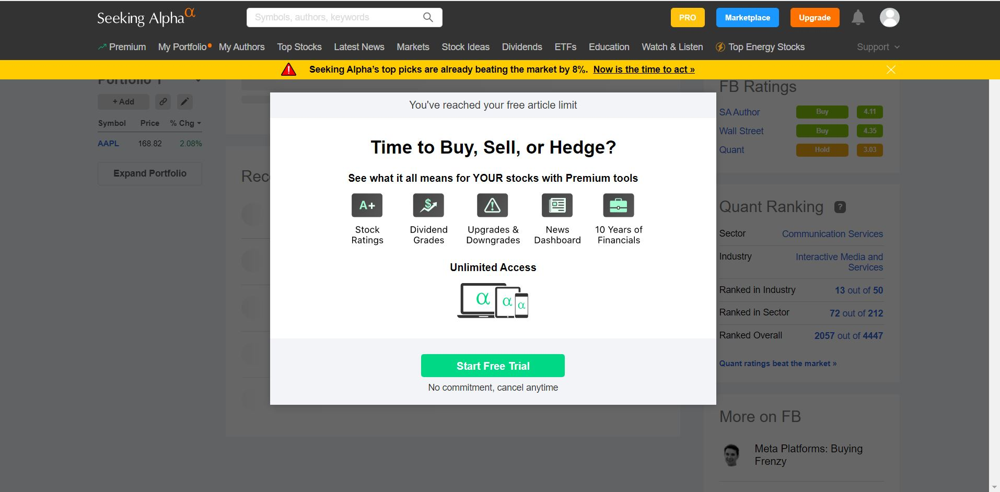
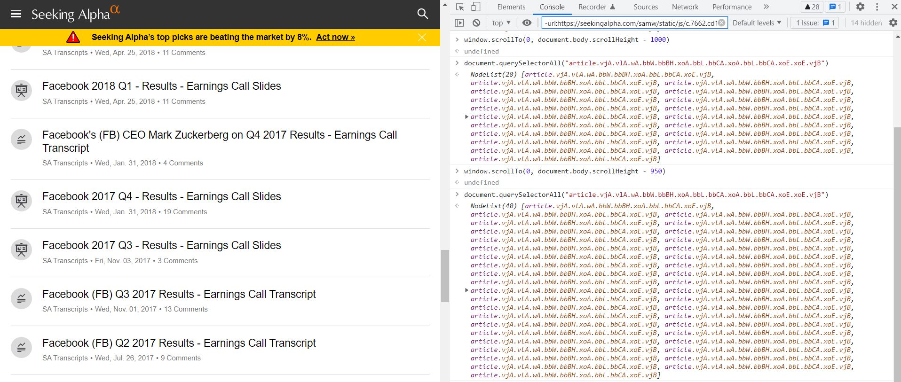
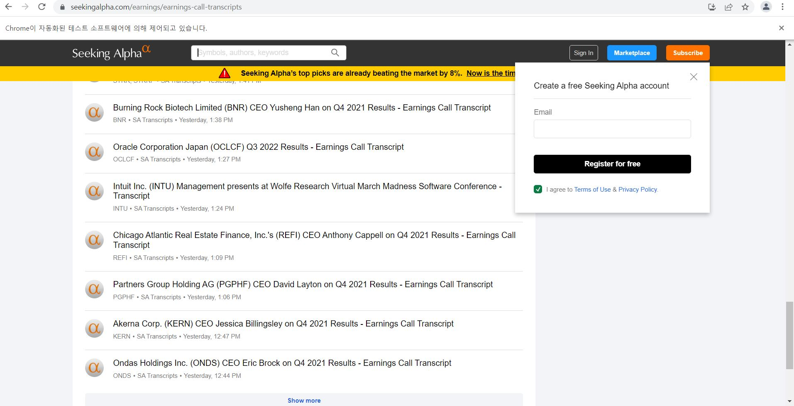
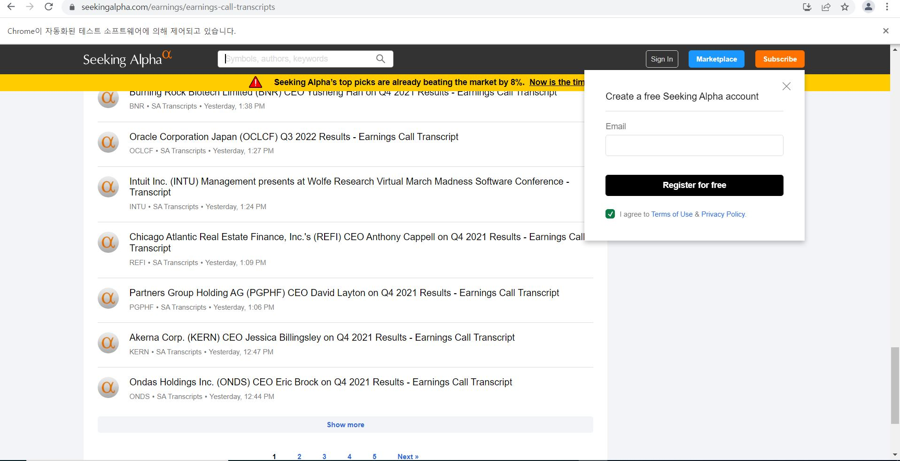
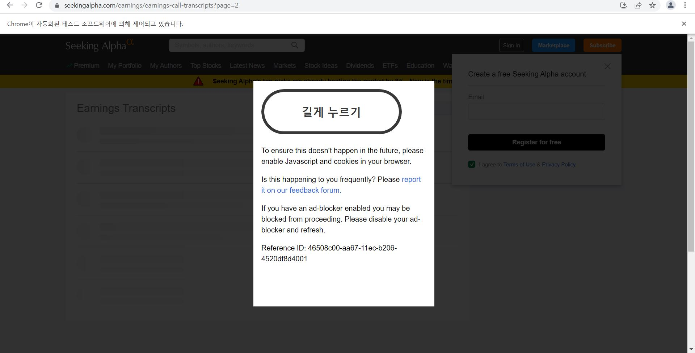

### 메인 페이지
https://seekingalpha.com/earnings/earnings-call-transcripts

</img>


- 이 페이지는 회사별로 등록된 Earning Transcript 정보를 요약해서 보여줍니다.
- `parsing`할 정보는 항목별 `Title`, `Link`, `Ticker`, `Author`, `Date`입니다(첫번째 항목에 빨간색 박스영역입니다.). 
- 페이지는 무한 스크롤로 동작하며 스크롤을 내렸을 때 특정 `ScrollHeight`마다 새로운 `20`개의 정보가 추가적으로 로딩됩니다.
- 이 페이지에 등록된 정보를 `parsing`한 결과는 다음과 같습니다.
    </img>


---

### 타겟 페이지
  
- 메인 페이지에서 각 항목의 타이틀을 클릭하면 원하는 article 페이지로 진입할 수 있습니다.
- `parsing` 하고싶은 정보는 노란색으로 표시된 텍스트 영역입니다.
- 메인 페이지에서 회사별 링크를 모두 파싱하고 타겟 페이지로 이동해 노란색 텍스트 영역을 크롤링하는 전략을 사용하려합니다. 
 
    </img>

---

### SeekingAlpha의 특징

1. **동적으로 동작하는 페이지**
   
</img>

---
- 크롬 관리자도구에서 `ctrl` + `shift` + `p`를 누르고 `javascript disable` 후 페이지를 새로고침하면 보통의 웹사이트의 경우 정적 리소스(이미지, 텍스트등)를 필요로하는 태그로 전달합니다. 하지만 이 사이트의 경우 html 페이지를 javascript로 동작시키는 특징이 있습니다.
    
- 따라서 `page resource`를 받아오기 위해 `selenium`을 사용해 페이지의 `html`이 렌더링을 마칠때까지 대기한 후에 비로소 `parsing`을 할 수 있습니다.
- 하지만 `selenium`을 사용하여 페이지 접속 시 seekingalpha.com/robots.txt에 명시된 모든 User-agent가 url endpoint에 resource 요청 시 로봇임을 감지하여 `captcha`를 띄웁니다.
  
- 예를들어 selenium(기계)을 사용해 robots.txt에 있는 `/article/`로 접속시 로봇임을 바로 감지하여 차단됩니다.
- 반면 일반적인 사용자가 `/article/~` 로 접속 시 서버는 2가지 다른 대응을 보입니다. 

    1. **로그인 하지 않은 유저의 경우**
   
        </img>

    2. **로그인한 유저의 경우**
        </img>
        - 비회원의 경우 무료로 `article` 5 페이지 열람 권한을 부여하고 이를 초과한 유저에게는 멤버십 가입을 요청합니다.

    
그렇다면 **captcha** 가 로딩되는 이유는 무엇일까요?
- `기계가 페이지에 접근하는 방식`과 `사람이 페이지에 접근하는 방식`의 차이를 이해하는 것이 중요하다고 생각합니다.

---
2. **무한스크롤**

- 페이지 전환이 아닌 스크롤을 내릴때마다 새로운 컨텐츠를 추가하는 방식을 무한 스크롤이라 합니다.
-  사람이 브라우저를 제어할 경우 무한 스크롤로 새로운 컨텐츠를 확인할 수 있습니다.
-  `selenium`을 통해 스크롤을 제어할 경우 서버는 2가지 다른 대응을 보입니다. 
    -  스크롤을 최하단 조금 윗쪽까지 내릴 경우
        - `show more`을 표시합니다. 이를 클릭하는 경우 `captcha`를 띄웁니다.
    - 스크롤을 최하단까지 내릴 경우 `pagination`을 표시합니다. 
      - 새로운 페이지를 클릭할 경우 `captcha`를 띄웁니다.

- 페이지 이동
  - 페이지마다 20개의 항목을 표시하며 다음과 같이 page를 변경하면서 url로 접근할 수 있지만 로봇을 통해 반복적으로 새로운 페이지로 이동하면 차단됩니다.
  -  "https://seekingalpha.com/earnings/earnings-call-transcripts?page={}".format(n)

#### 스크롤을 내리면 특정 scrollHeight를 넘을 때마다 20개의 항목이 새롭게 추가됩니다.
</img>

### 스크롤까지 마지막 조금 위쪽까지 내릴 경우 `show more`을 표시합니다.
</img>


### 스크롤을 마지막까지 내릴 경우 `Pagination`을 보여줍니다.

</img>

---
3. **서버는 사람과 기계를 탐지하며 robots.txt에 명시된 크롤링 금지 endpoint에 접근시 곧바로 Captcha를 띄웁니다.**


</img>

- 일반 크롬 브라우저로 접근하여 리소스 요청시 `captcha`가 뜨지 않지만 기계로 접근한 경우 곧바로 차단하여 `captcha`를 띄웁니다.
- 이는 기계임을 탐지하여 해당 IP를 일시적으로 차단하는 것 같습니다. 
- 길게 누르기가 한글로 표시되는 이유는 요청 헤더에 ko-kr 정보를 읽었다는 증거입니다.
- 길게 누르기를 눌러도 차단된 IP의 경우 같은 `captcha`가 반복적으로 로딩되며 `redirection` 되지 않습니다.

---
### 대응방안

- 이 문제를 해결하기 위해 앞으로 아래의 내용을 공부할 예정입니다.
- 메인 페이지에서 회사별 링크를 모두 파싱하고 타겟 페이지로 이동해 노란색 텍스트 영역을 크롤링하는 전략을 계속 시도할 예정입니다.

---
**서버가 로봇을 어떻게 탐지하고 비정상 접근을 차단하는지를 이해.**


**Server Side Bot Detection**

    - HTTP Fingerprinting
    - TCP/IP Stack Fingerprinting
    - TLS Fingerprinting
    - Behavior Analysis and Pattern Detection       

**Client Side Bot Detection**

      - User Agent
      - Current Language
      - Do Not Track Status
      - Supported HTML5 Features
      - Supported CSS Rules
      - Supported Javascript Features
      - Plugins installed in Browser
      - Screen Resolution, Color Depth
      - Time Zone
      - OS
      - Number of CPU Cores
      - The list of fonts have installed on the computer

**Detection tool**
    
      - Presence of bot specific signatures
      - Support for non standard browser features
      - Presence of common automation tools such as Selenium, Puppeteer, Playwright, etc
      - Human generated events such as randomized Mouse Movement, Clicks, Scrolls, Tab Changes

---
- **사람이 브라우저에 접근하는 것 처럼 서버에 접근하기.**
  - 크롤링 패턴을 다양화합니다.
    - 사람은 보통 random한 action을 취하며 기계처럼 반복적인 작업을 하지않습니다.
    - `anti-crawling mechanism`을 잘 갖춘 사이트는 크롤러의 행동 패턴을 발견하여 쉽게 스크래퍼를 차단할 수 있습니다.
    - 페이지에서 마우스 클릭, 마우스 움직임, 사람처럼 보이게하는 임의의 동작을 포함시킬 수 있습니다.
    - auto throttling mechanism
  - 프록시를 통해 `request`를 만들고 필요에따라 변경해야 합니다.
    - 서버는 사이트에 접속한 신규 유저가 어떻게 행동하는지를 추적합니다.
    - 같은 IP로 다수의 요청이 오는 경우 차단될 수 있습니다.
    - 따라서 여러개의 IP 주소가 필요하며 `proxy machine`으로 부터 request를 보낼 때 서버는 original IP가 어디서 왔는지 알지 못하며 탐지가 어려워집니다.
    - IP 주소의 Pool을 만들고 이를 랜덤하게 사용해야합니다.
    - IP를 변경하는 다양한 방법이 있습니다. 이들 각각의 장단점이 있으며 직접 사용해보고 비교,분석을 해보려합니다.
        ```
        1. TOR
        2. VPNs
        3. Free Proxies
        4. Shared Proxies 
        5. Private Proxies 
        6. Data Center Proxies, 
        7. Residential Proxies
        ```
  - User Agent
    - user agent는 서버에게 어떤 웹 브라우저가 사용되는지를 알려주는 도구입니다. 만약 유저 에이전트가 설정되지 않은 경우 서버는 클라이언트에게 리소스를 전달하지 않습니다. 
    - 하나의 user agent만 사용해 반복적인 요청을 하는 경우 서버는 크롤러를 차단합니다. 
    - 사람이 페이지에 접근하는 방식처럼 `request header`를 구성해야합니다.
      - request header에 대한 추가적인 공부 필요
      - 헤더 정보를 다양하게 구성하고 접속을 시도할 예정 
    
